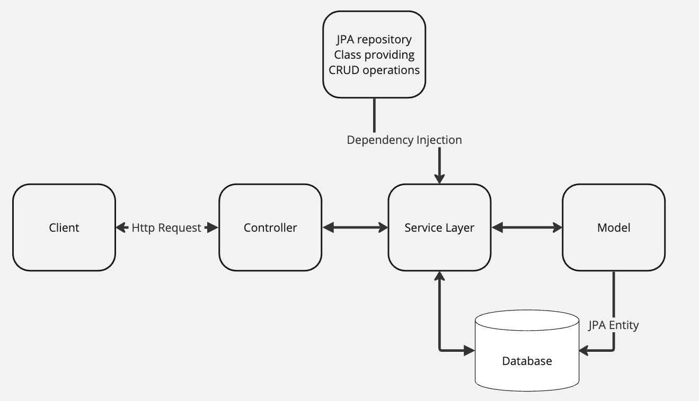
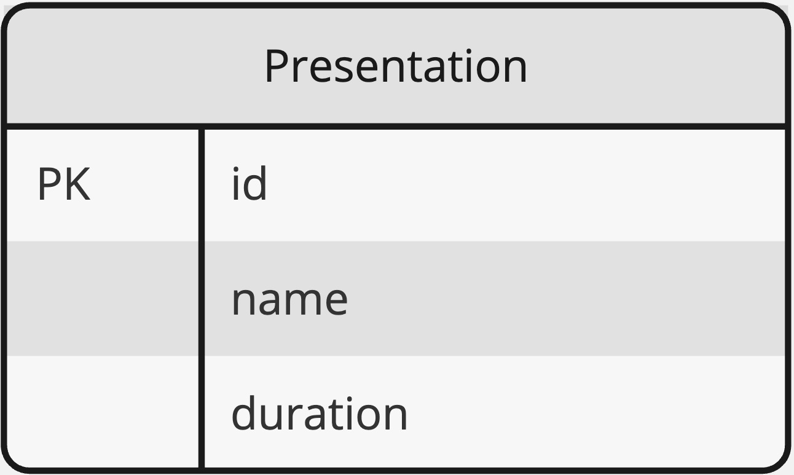

# EventFlow: Conference Scheduling Application

## Project Description

EventFlow is a Java-based web application designed for scheduling and managing sessions at software conferences. It automates the distribution of talks throughout the day, respecting specific time constraints for morning and afternoon sessions. The application includes features for submitting talk details, automatically arranging these talks into a coherent schedule, and displaying the conference agenda.

## Features

- Schedule talks for morning and afternoon sessions.
- Support for concurrent sessions in both morning and afternoon.
- Dynamic allocation of talks to appropriate time slots.
- Automated adjustment of networking events based on session timings.

## Technical Details

## Architecture Overview

EventFlow follows the Model-View-Controller (MVC) architectural pattern, tailored for a decoupled backend system that interacts with a client, possibly a frontend or API consumer. Below is a detailed explanation along with the high-level system architecture diagram:

### Model
- **Model**: Represents the application's domain data structure. In EventFlow, the model includes entities such as conference sessions, talks, and schedules, which are reflected in the database schema.

### View
- **View**: In this context, the view is not a traditional GUI but the presentation of data in a format suitable for the client, often JSON responses generated by the server sent back to the client.

### Controller
- **Controller**: Acts as an intermediary between the view and the model. It handles incoming HTTP requests, invokes the service layer for data processing, and returns the appropriate response to the client.

### Service Layer
- **Service Layer**: Contains the business logic of the application. It's responsible for processing data sent to and from the model and the controller.

### Database
- **Database**: The persistent storage mechanism for the application. EventFlow uses PostgreSQL, managed via JPA repositories that provide CRUD operations on the data models.

The following diagram provides a visual representation of these components and their interactions:



Each component in the architecture plays a specific role in the overall function of the application, ensuring a clean separation of concerns and facilitating maintainability and scalability.

## Algorithm Approach and Efficiency

EventFlow utilizes a custom algorithm for scheduling conference talks into morning and afternoon sessions. The primary goal of this algorithm is to maximize the usage of available time slots while adhering to the constraints of the conference schedule.

### Algorithm Overview

The scheduling process involves the following steps:

1. **Input Processing**: The algorithm takes a list of presentations, each with a specified duration.
2. **Session Allocation**: Talks are allocated to either a morning or afternoon session based on their duration and the remaining time in the session.
3. **Special Case Handling**: The algorithm handles cases where talks have specific time requirements (e.g., lightning talks) or when a session is fully occupied.
4. **Networking Event Scheduling**: The algorithm schedules a networking event at the end of the day if time permits. The event starts no earlier than 4 PM and no later than 5 PM.

### Key Considerations

- **Efficiency**: The algorithm is designed to run efficiently, with the complexity primarily depending on the number of talks to be scheduled.
- **Flexibility**: It can handle varying lengths of talks and adjusts the schedule dynamically based on the talks' order and duration.
- **Robustness**: Special scenarios, like overlong talks or fully occupied sessions, are handled gracefully to ensure a feasible conference schedule.

### Data Structures and Complexity

- **Data Structures**: The algorithm uses a queue data structure (`LinkedList`) for storing and processing presentation data. This choice facilitates efficient addition and removal of elements, which is crucial for dynamic scheduling.
- **Time Complexity**: The time complexity of the algorithm is primarily linear, O(n), where 'n' is the number of talks. Each talk is processed once, and decisions are made based on its duration.
- **Space Complexity**: The space complexity is also linear, O(n), as the algorithm stores the talks in a queue and additional data structures for the scheduled sessions.

### Alternative Approaches

- **Bin Packing Algorithm**: An alternative approach could be implementing a bin packing algorithm, where the goal is to pack objects (talks) of different sizes (durations) into a finite number of bins (sessions) in the most efficient way.
- **Genetic Algorithms or Machine Learning**: These could be explored for more complex scheduling requirements, especially when dealing with a larger number of constraints or preferences.

### Conclusion

The current algorithm in EventFlow strikes a balance between efficiency and simplicity, making it well-suited for the task of conference scheduling. Future enhancements could explore more complex algorithms for optimized scheduling in larger-scale conferences or events with more intricate requirements.


### Technologies
EventFlow utilizes a range of technologies, each playing a crucial role in the application's functionality and performance:

- **Spring Boot**: A key framework for creating stand-alone, production-grade Spring-based applications. Spring Boot simplifies the development process, offering easy configuration, embedded servers, and a wide range of starter packages. In EventFlow, Spring Boot is used to set up and configure the backend server, integrate with other Spring components, and manage application contexts and dependencies.
- **Maven**: A powerful project management and comprehension tool. Maven provides a high degree of control over project builds and dependencies. It simplifies the build process in EventFlow by managing project dependencies, automating builds, and ensuring consistent project structure.
- **JUnit**: The de-facto standard for unit testing in Java applications. JUnit is used in EventFlow for writing and executing unit tests, ensuring the reliability and correctness of the codebase. It plays a crucial role in maintaining code quality and facilitating test-driven development.
- **JPA/Hibernate**: JPA (Java Persistence API) and Hibernate facilitate database operations. JPA, as an ORM specification, simplifies database interaction, while Hibernate, as a JPA implementation, efficiently maps an object-oriented domain model to a relational database, enhancing database operations in EventFlow.
- **PostgreSQL**: A robust, open-source object-relational database system used in production environments for its performance and compatibility with JPA/Hibernate. It stores and manages all data for the EventFlow application.
- **ModelMapper**: Facilitates object mapping, particularly between domain and DTO objects, reducing boilerplate code and ensuring a clean, maintainable codebase.
- **Postman (for API testing)**: An essential tool for designing, testing, documenting, and monitoring the RESTful APIs of EventFlow, providing an interface for sending requests and viewing responses.

## Project Structure

The EventFlow project consists of several key components:

- **Controller Classes**: Manage HTTP requests and application flow.
    - `ConferenceAgendaController`: Manages interactions related to the conference agenda.
    - `PresentationController`: Handles requests for managing presentations.

- **Service Classes**: Contain the core business logic.
    - `PresentationService`: Manages operations related to presentations.
    - `ConferenceAgendaService`: Handles the generation and management of the conference agenda.

- **Model Classes**: Define the data structure.
    - `Presentation`: Represents a single presentation with details like title, duration, etc.

- **Repository Interfaces**: Interface with the database.
    - `PresentationRepository`: Manages CRUD operations for `Presentation` entities.

- **DTO Classes**: Facilitate data transfer.
    - Presentation-related DTOs (e.g., `PresentationListDTO`, `PresentationInfoDTO`)
    - Agenda-related DTOs (e.g., `ConferenceAgendaUtilDTO`, `TrackResponseDTO`)

- **Utility Classes**:
    - `ConferenceAgendaUtil`: Provides algorithms for scheduling presentations within sessions.
    - `GenericResponseHandler`: Handles and formats response data.
    - `MapperUtil`: Facilitates object mapping.

- **Configuration Classes**:
  - `ModelMapperConfig`: Configures the ModelMapper utility.

- **Constants Classes**:
  - `CommonConstants`, `ResponseDictionary`, etc.: Define various constants.

- **Exception Handling Classes**:
  - `InvalidParameterException`: Handles invalid parameter scenarios.

## Database Design

The diagram below represents the structure of the "Presentation" table used in EventFlow:



## Database Setup with Docker

EventFlow uses PostgreSQL as its database. For ease of setup and consistency across environments, we recommend using Docker to run a PostgreSQL container. Follow these steps to set up the PostgreSQL database:

1. **Install Docker**: If you don't have Docker installed, download and install Docker from the [official Docker website](https://www.docker.com/get-started).

2. **Run PostgreSQL Container**:
  - Use the following command to run a PostgreSQL container:
    ```bash
    docker run --name eventflow-postgres -e POSTGRES_PASSWORD=mysecretpassword -e POSTGRES_DB=eventflow -p 5432:5432 -d postgres
    ```
  - This command starts a new container named `eventflow-postgres` with PostgreSQL.
  - `mysecretpassword` should be replaced with your desired password.
  - The `-p 5432:5432` option maps the default PostgreSQL port from the container to the host.
  - `eventflow` is the name of the database created automatically in the container.

3. **Configure Application**:
  - Update the `application.properties` file in your EventFlow project to point to the Dockerized PostgreSQL instance:
    ```
    spring.datasource.url=jdbc:postgresql://localhost:5432/eventflow
    spring.datasource.username=postgres
    spring.datasource.password=mysecretpassword
    ```
  - Replace `mysecretpassword` with the password you set for the PostgreSQL container.

4. **Verify Connection**:
  - Once the application is started, it should connect to the PostgreSQL database running in Docker.

## Data Setup

EventFlow includes a `data.sql` file for seeding initial data into the database. This script populates the `presentation` table with a predefined set of presentation entries, providing a base for testing and demonstration purposes.

### Steps for Data Seeding:

1. Ensure the `spring.jpa.defer-datasource-initialization=true` and `spring.sql.init.mode=always` properties are set in your `application.properties`. This configuration allows Spring Boot to execute the `data.sql` script after the JPA entities have been created.

2. Upon starting the application, Spring Boot will automatically execute the `data.sql` script, seeding your database with the initial data.

## Running the Application

Follow these steps to run the EventFlow application:

1. Clone the repository to your local machine.

2. Set up the application properties:
    - Configure `application.properties` with necessary database credentials.

3. Build and run the application:

```bash
./mvnw spring-boot:run
```

4. Access the application at `http://localhost:8080/`.

## Application Usage

EventFlow provides RESTful endpoints to manage conference agendas and presentations:

### Conference Agenda

- `GET /agenda`: Retrieve the full conference agenda.
  - This endpoint returns the complete conference agenda, including all scheduled talks and their details.

### Presentation Management

- `POST /presentation/create`: Submit a new presentation.
  - This endpoint accepts a JSON payload with a `name` and `duration` for the new presentation. The `name` is a string and should not be blank, and the `duration` is an integer representing the length of the talk in minutes, which must be greater than zero.

- `GET /presentation/get-all`: Get a list of all presentations.
  - Use this endpoint to retrieve a list of all submitted presentations, including their names and durations.

Both endpoints are designed to facilitate the management of talks within the EventFlow system, allowing for the creation of new presentations and retrieval of the conference agenda. The endpoints can be accessed through any HTTP client or integrated into a frontend application to interact with the EventFlow service.

## API Testing with Postman

EventFlow includes a Postman collection to facilitate testing and interaction with the application's RESTful endpoints.

- **Postman Collection**: The collection contains pre-configured requests for all the available endpoints in the EventFlow application, making it easier to test the functionality of the application without setting up a frontend interface.

### Using the Postman Collection:

1. If you don't have Postman installed, download and install it from the [official Postman website](https://www.postman.com/downloads/).

2. Navigate to the `postman` directory in the repository and import the `EventFlow API.postman_collection.json` file into Postman.

3. Once imported, you will have access to all the pre-configured requests that correspond to the endpoints exposed by EventFlow.

4. Make sure to update the environment variables in Postman if your application is not running on `localhost:8080`.

This Postman collection is an invaluable tool for developers looking to test the application's endpoints quickly and efficiently.

## Error Handling

EventFlow includes comprehensive error handling, providing appropriate HTTP response statuses and messages for various error scenarios.

## Testing

Testing is a crucial part of the EventFlow application development process, ensuring that all features work as intended and the scheduling algorithm performs correctly under various scenarios.

### Test Strategy

We employ a comprehensive test strategy that includes:

- **Unit Testing**: Focused on individual components to validate that each unit of the software performs as designed.
- **Edge Case Testing**: Identifying and testing the boundaries of the software to ensure stability under extreme conditions.

### Test Tools

- **JUnit**: Utilized for writing and executing unit tests.
- **Mockito**: Employed for mocking objects and testing in isolation.
- **Spring Boot Test**: For integration tests with Spring context loading.

### Test Implementation

Tests are written using JUnit and Mockito frameworks, which provide a robust platform for assertion and object mocking capabilities, ensuring that each component can be tested in isolation or in conjunction with others.

### Specific Tests Conducted

- `testAllocateSessions_WithValidPresentations`: Validates that a normal list of presentations is scheduled correctly, including lunch and networking events.
- `testAllocateSessions_WithEmptyList`: Checks the behavior when no presentations are provided.
- `testWithPresentationsFillingExactlyOneSession`: Ensures that presentations that exactly fill a session block are handled correctly.
- `testWithExcessiveNumberOfPresentations`: Tests the system's ability to handle a large number of presentation requests.
- `testWithPresentationsThatExactlyFitAMorningSession`: Verifies that presentations that fit perfectly into a morning session are scheduled without issues.
- `testWithMaximumDurationPresentations`: Checks if presentations with maximum allowed durations are scheduled properly and if the algorithm correctly omits the networking event when the afternoon session is full.

### Test Results
Recent test execution confirmed all components are functioning as intended:

```bash
Total Tests: 6
Passed: 6
Failed: 0
Duration: 647 ms
```

## Conclusion

EventFlow is a robust, Java-based web application for efficiently scheduling talks at software conferences. It features a clean MVC architecture, with a focus on code quality and maintainability. The application simplifies the complex task of conference scheduling, ensuring a well-organized event.
